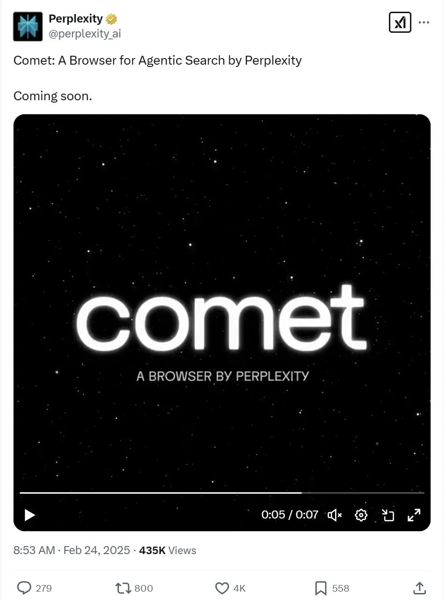

# Perplexity Launches Comet: An AI-Powered Browser That Might Actually Change How You Browse

---

So you've been using the same browser for years, maybe Chrome or Safari, and honestly? It works fine. But here's the thing—Perplexity, the AI search engine that's been quietly eating Google's lunch, just announced they're building a browser called Comet. And if their track record with search tells us anything, this could get interesting. Whether you're tired of juggling tabs, drowning in bookmarks, or just curious about what an AI-powered browser actually means for your daily workflow, this might be worth paying attention to.

---

## What We Know (And Don't Know) About Comet

Perplexity dropped the news on X this Monday. No big press conference, no flashy demo—just a sign-up page and a promise: "Just like Perplexity reinvented search, we're also reinventing the browser."

Classic tech company move, right? Build hype, reveal nothing.

A spokesperson told TechCrunch they're working on it, but wouldn't share a release date or feature list. So we're all just sitting here, refreshing our inboxes, waiting to see what "reinventing the browser" actually means.

But here's what we can piece together: Perplexity built its reputation on AI-powered search that actually understands what you're asking. Not just keyword matching—actual comprehension. If they bring that same intelligence to browsing, we might be looking at something that anticipates what you need before you even click.

## The Browser Wars Are Back (And They're Weird Now)

Remember when picking a browser was simple? Internet Explorer or... well, Internet Explorer?

Now we've got Chrome dominating with like 65% market share, Safari holding down the Apple ecosystem, Edge trying really hard to be relevant, and Firefox still hanging in there for the privacy-conscious crowd.

And then there are the new kids. The Browser Company is launching something called Dia. Arc browser has a cult following among designers. Everyone's adding AI features—chat assistants, tab organizers, reading summaries.

👉 [See how AI-powered search is already changing the game for researchers and professionals](https://pplx.ai/ixkwood69619635)

The thing is, most of these "AI features" feel tacked on. Like someone said "we need AI in this" during a product meeting, and now there's a chatbot icon sitting awkwardly in your toolbar.

Perplexity has an advantage here. They're not retrofitting AI into an existing browser—they're building from scratch with AI as the foundation. That's a different approach entirely.

## The Numbers Behind Perplexity's Confidence

You don't just wake up one day and decide to take on Chrome unless you've got some momentum.

Perplexity's got momentum.

By October 2024, they were handling about 100 million search queries per week. That's not Google numbers, but it's not nothing either. They've raised over $500 million in funding and hit a $9 billion valuation.

More importantly, they're moving fast:

**February 2025:** Launched a deep research tool to compete directly with OpenAI, Google, and xAI. Not just "we have AI too"—actual competition.

**January 2025:** Released an AI-powered Android assistant and opened up an API for AI search. They're building an ecosystem, not just a product.

This isn't a side project. Comet is part of a bigger play to own more of your digital workflow—from search to browsing to research.

## The Legal Drama Nobody Wants to Talk About

Okay, we have to address the elephant in the room.

Perplexity is getting sued. News Corp's Dow Jones and the New York Post claim Perplexity scrapes and republishes their content without permission. The New York Times sent a cease-and-desist letter in October 2024.

Perplexity says they respect publisher content and even offer a revenue-sharing program for news outlets. The publishers say that's not enough.

This matters for Comet because if the browser uses similar AI-powered content aggregation, those legal issues don't just go away. They might get bigger.

It's the classic tech startup dilemma: move fast and break things, then deal with the lawsuits later. Sometimes that works. Sometimes it doesn't.

## What Could Make Comet Actually Different

Here's the real question: why would anyone switch browsers?

Chrome works. Safari works. Even Edge works now (I know, I'm surprised too).

For Comet to matter, it needs to do something genuinely better. Not just different—better.

Based on what Perplexity's already built, here's what might set Comet apart:

**Contextual understanding:** Imagine a browser that knows you're researching vacation spots and automatically organizes your tabs, saves relevant info, and surfaces related content without you asking.

**Integrated search and browsing:** Instead of searching in one place and browsing in another, what if they were the same thing? You ask a question, and the browser doesn't just show you links—it shows you answers, with sources, all in one flow.

**Privacy with intelligence:** DuckDuckGo and Brave proved people care about privacy. But they sacrifice some convenience for it. Maybe Comet finds a middle ground—AI-powered features that don't require selling your data.

Of course, this is all speculation. Perplexity hasn't confirmed any of this. But if they're not doing something along these lines, why bother building a browser at all?

## The Bigger Picture: Who Owns Your Internet Experience

Here's what's really happening.

Google owns search and the browser most people use. That's a lot of power over how you experience the internet.

Apple owns the hardware, the operating system, and the default browser for a billion devices.

Microsoft is trying to own the AI layer on top of everything.

Perplexity is making a bet that there's room for someone else—someone who puts AI-powered understanding at the center of the experience, not as an add-on feature.

👉 [Discover why AI-powered tools are becoming essential for modern workflows](https://pplx.ai/ixkwood69619635)

It's ambitious. Maybe too ambitious. But then again, people said the same thing when they launched their search engine.

## Will Comet Actually Matter?

Honestly? Too early to tell.

The browser market is brutal. Even Microsoft, with all its resources, couldn't make Internet Explorer relevant again (hence Edge). Google Chrome succeeded because it was genuinely faster and better when it launched in 2008.

For Comet to work, it needs to be genuinely better too. Not just "has AI features" better—actually solves problems you didn't know you had better.

Perplexity has the funding, the user base, and the technical chops. They've already proven they can compete with Google in search, which seemed impossible a few years ago.

But browsers are different. People are creatures of habit. Switching browsers is annoying. All your passwords, bookmarks, extensions—it's a whole thing.

Comet needs to be so much better that people are willing to deal with that annoyance. That's a high bar.

## What Happens Next

Perplexity will keep building. The sign-up list will grow. Eventually, they'll release something—maybe a beta, maybe a full launch.

Some people will try it out of curiosity. Tech enthusiasts will write hot takes. The legal battles will continue in the background.

And we'll find out if "reinventing the browser" was visionary or just good marketing.

My guess? It'll be somewhere in between. Comet probably won't kill Chrome overnight. But it might introduce ideas that change how we think about browsing. And then, like always in tech, everyone else will copy the good parts.

That's how progress happens. Not with one revolutionary product, but with a series of improvements that compound over time.

Whether Comet becomes your daily driver or just another interesting experiment, it's worth watching. Because when companies with Perplexity's resources and ambition decide to shake things up, interesting things tend to happen.

---

So Comet is coming. We don't know exactly when or what it'll look like, but Perplexity's track record suggests it won't be boring. They've already shown they can compete with Google in search by focusing on AI-powered understanding and user experience. If they bring that same approach to browsing, we might actually have a reason to rethink our default browser choice. And if you're curious about what AI-powered search already looks like in action, that's one reason why Perplexity is suitable for anyone tired of wading through ten blue links to find actual answers.
